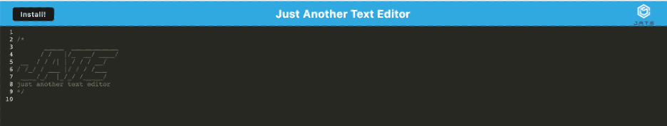

# Text Editor

## Technology Used 

| Technology Used         | Resource URL           | 
| ------------- |:-------------:| 
| JavaScript    | [https://developer.mozilla.org/en-US/docs/Web/JavaScript](https://developer.mozilla.org/en-US/docs/Web/JavaScript) | 
| Node.js     | [https://nodejs.org/en/](https://nodejs.org/en/)      |   
| Webpack | [https://webpack.js.org/](https://webpack.js.org/)     |    
| IndexedDB | [https://developer.mozilla.org/en-US/docs/Web/API/IndexedDB_API](https://developer.mozilla.org/en-US/docs/Web/API/IndexedDB_API) |
| Concurrently | [https://www.npmjs.com/package/concurrently](https://www.npmjs.com/package/concurrently) |
| Heroku | [https://www.heroku.com/home](https://www.heroku.com/home) |

<br />

## Table of Contents
- [Technology Used](#technology-used)
- [Table of Contents](#table-of-contents)
- [Description](#description)
- [Code Refactor Example](#code-refactor-example)
  - [Webpack Configuration](#webpack-configuration)
  - [Database Functions](#database-functions)
  - [Installation Functions](#installation-functions)
- [Installation and Usage](#installation-and-usage)
- [Learning Points](#learning-points)
- [Author Info](#author-info)
  - [Ryan Moscoe](#ryan-moscoe)
- [Credits](#credits)
- [License](#license)

<br />

## Description 

[Visit the Deployed Site](https://vast-wave-58973.herokuapp.com/)

This progressive web app (PWA) loads a basic text editor in a browser. The editor automatically saves text entered by the user in a client-side database using IndexedDB and retrieves the user's saved text on load. In addition, the user can install the editor as an app for offline use.

<br />



<br />

## Code Refactor Example

Starter code was provided for this project, including an HTML document, CSS stylesheet, and server-side code. Three components  of the client-side JavaScript code required completion:
* The webpack configuration file (webpack.config.js)
* The database functions for saving and retrieving data (database.js)
* The installation script (install.js)
 
 <br />

### Webpack Configuration
The webpack.config.js file initially included the following code:

```javascript
module.exports = () => {
  return {
    mode: 'development',
    entry: {
      main: './src/js/index.js',
      install: './src/js/install.js'
    },
    output: {
      filename: '[name].bundle.js',
      path: path.resolve(__dirname, 'dist'),
    },
    plugins: [
      
    ],

    module: {
      rules: [
        
      ],
    },
  };
};
```

After configuring webpack plugins for a service worker and a manifest file, as well as adding css and babel loaders, the final code looked like this: 

```javascript
module.exports = () => {
  return {
    mode: 'production',
    entry: {
      main: './src/js/index.js',
      install: './src/js/install.js'
    },
    output: {
      filename: '[name].bundle.js',
      path: path.resolve(__dirname, 'dist'),
      publicPath: "./"
    },
    plugins: [
      new HtmlWebpackPlugin({
        template: './index.html',
        title: 'Just Another Text Editor'
      }),
      new InjectManifest({
        swSrc: "./src-sw.js",
        swDest: "src-sw.js"
      }),
      new WebpackPwaManifest({
        inject: true,
        fingerprints: false,
        name: "Just Another Text Editor",
        short_name: "JATE",
        description: "A progressive web app for text editing",
        background_color: "#ffffff",
        crossorigin: "use-credentials",
        publicPath: "/",
        start_url: "/",
        icons: [
          {
            src: path.resolve("src/images/logo.png"),
            sizes: [96, 128, 192, 256, 384, 512],
            destination: path.join("assets", "icons")
          }
        ]
      })
    ],

    module: {
      rules: [
        {
          test: /\.css$/i,
          use: ['style-loader', 'css-loader'],
        },
        {
          test: /\.(png|svg|jpg|jpeg|gif)$/i,
          type: 'asset/resource',
        },
        {
          test: /\.m?js$/,
          exclude: /node_modules/,
          use: {
            loader: 'babel-loader',
            options: {
              presets: ['@babel/preset-env'],
              plugins: ['@babel/plugin-proposal-object-rest-spread', '@babel/transform-runtime'],
            },
          },
        }
      ],
    },
  };
};
```

<br />

### Database Functions

Similarly, the database functions were not built out in the starter code:

```javascript
export const putDb = async (content) => console.error('putDb not implemented');

export const getDb = async () => console.error('getDb not implemented');
```

The putDB function ultimately took the following form:

```javascript
export const putDb = async (content) => {
  const jateDb = await openDB("content", 1);
  const tx = jateDb.transaction("content", "readwrite");
  const store = tx.objectStore("content");
  const request = store.put({content});
  const result = await request;
  return result;
}
```

<br />

### Installation Functions

Finally, the installation functions were initially empty:

```javascript
window.addEventListener('beforeinstallprompt', (event) => {});

butInstall.addEventListener('click', async () => {});

window.addEventListener('appinstalled', (event) => {});
```

Here is the fully built click event handler:

```javascript
butInstall.addEventListener('click', async () => {
    const promptEvent = window.deferredPrompt;
    if (!promptEvent) {
        return;
    }
    promptEvent.prompt();
    await promptEvent.userChoice;
    window.deferredPrompt = null;
    butInstall.textContent = "Installed";
});
```

<br />

## Installation and Usage 

To install this application, click the ```Install``` button at the top of the screen or the  icon in the address bar of the browser. To use the application, enter text or code. The editor automatically saves your entry to the database and retrieves it the next time you launch the page or open the application.

<br />


## Learning Points 

* Progressive Web Apps (PWAs)
* Webpack
* IndexedDB
* Concurrently

<br />

## Author Info

### Ryan Moscoe 

* [Portfolio](https://rmoscoe.github.io/my-portfolio/)
* [LinkedIn](https://www.linkedin.com/in/ryan-moscoe-8652973/)
* [Github](https://github.com/rmoscoe)

<br />

## Credits

Starter code provided by Trilogy Education Services, LLC, a 2U, Inc. brand, on behalf of the University of California, Berkeley Coding Boot Camp.

<br />

## License

See repository for license information.